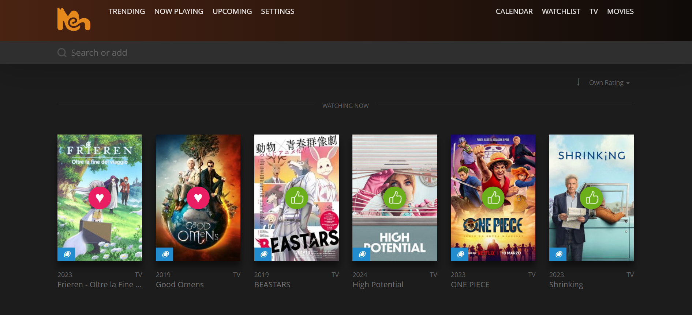

# Flomeh

Flomeh e' un fork di [Flox](https://github.com/devfake/flox), un media tracker self-hosted per film, serie TV e anime. Usa Laravel 6 e Vue.js, con dati presi da [The Movie Database](https://www.themoviedb.org/).

Questa versione e' stata adattata per un uso locale con Laragon e aggiunge alcune migliorie per tracciare meglio la propria libreria:

- home divisa tra `Watching now`, elementi non seguiti ora e contenuti visti/completati;
- caricamento manuale delle sezioni non attive, cosi' la home resta leggera;
- import piu' prudente, senza ridurre il progresso gia' salvato nel database;
- setup Windows/Laragon semplificato.



## Requisiti

- Laragon con Apache e MySQL.
- PHP 7.2, 7.3 o 7.4. Laravel 6 non e' pensato per PHP 8.
- Composer.
- Una chiave gratuita TMDB: https://www.themoviedb.org/settings/api

Il frontend Vue e' gia' compilato in `public/assets`, quindi non serve `npm install` per installare e usare l'app.

## Installazione rapida con Laragon

1. Clona o copia il repository nella root web di Laragon, per esempio:

```bat
cd C:\laragon\www
git clone https://github.com/krikkemeh/flomeh.git flomeh
cd flomeh
```

2. Avvia Laragon e apri il Terminal di Laragon nella cartella del progetto.

3. Esegui:

```bat
setup-laragon.bat
```

Lo script:

- crea `backend\.env` da `backend\.env.laragon.example` se manca;
- chiede l'URL dell'app e aggiorna `APP_URL`/`CLIENT_URI`;
- crea le cartelle scrivibili usate da poster, backdrop, export e cache Laravel;
- prova a creare il database MySQL `flox` con l'utente Laragon predefinito `root` senza password;
- esegue `composer install`;
- genera `APP_KEY` solo se manca;
- esegue migrazioni e crea l'utente iniziale sulle nuove installazioni.

4. Apri `backend\.env` e imposta la tua chiave TMDB:

```env
TMDB_API_KEY=la_tua_chiave
```

5. Avvia Apache e MySQL da Laragon, poi visita l'URL scelto nello script. Il valore predefinito e':

```text
http://localhost/flomeh
```

Login iniziale per nuove installazioni:

```text
admin / admin
```

Cambia la password dalle impostazioni appena entri.

## Configurazione Laragon

Con Laragon di solito basta mettere la cartella nella root web e aprire il progetto come sottocartella di localhost. Se usi una porta diversa, per esempio `http://localhost:8080/flomeh`, inserisci quell'URL quando lo script lo chiede.

Se devi correggerlo a mano, aggiorna `backend\.env`:

```env
APP_URL=http://localhost:8080/flomeh
CLIENT_URI=/flomeh
```

Poi pulisci la cache di configurazione:

```bat
cd backend
php artisan config:clear
```

Per dettagli specifici su Laragon vedi [`LARAGON.md`](./LARAGON.md).

## Installazione manuale

Se non usi Laragon:

```bash
cd backend
composer install --no-dev --optimize-autoloader
cp .env.example .env
php artisan key:generate
```

Configura `backend/.env` con database, `APP_URL`, `CLIENT_URI` e `TMDB_API_KEY`, poi esegui:

```bash
php artisan migrate --force
php artisan flox:db admin admin
```

Assicurati che siano scrivibili:

- `backend/storage`
- `public/assets/poster`
- `public/assets/poster/subpage`
- `public/assets/backdrop`
- `public/exports`

## Worker e aggiornamenti

Import, refresh e aggiornamenti automatici usano la queue Laravel. Per avviare un worker:

```bat
cd backend
php artisan queue:work --tries=3
```

Su un server Linux puoi usare anche lo script originale:

```bash
bash ./bin/install_worker_service.sh
```

Per gli aggiornamenti schedulati serve il cron Laravel:

```cron
* * * * * php /path/to/flox/backend/artisan schedule:run >> /dev/null 2>&1
```

## Export e dati locali

Gli export generati dall'app, i poster, i backdrop scaricati, i log, la cache Laravel, `backend/.env` e `backend/vendor` sono esclusi dal repository. Nel repo resta solo `public/exports/.gitkeep`, cosi' la cartella esiste ma i backup personali non vengono pubblicati.

## Sviluppo frontend

Per modificare il frontend:

```bash
cd client
npm install
npm run dev
```

In questa copia i bundle compilati `public/assets/app.js` e `public/assets/app.css` sono tracciati per permettere l'installazione senza build frontend.

## Import

L'import e' pensato per non perdere progresso gia' registrato: se un titolo esiste gia' e nel database risultano visti piu' episodi rispetto al file importato, il valore piu' avanzato viene mantenuto.

## Licenza

Flox e' pubblicato con licenza MIT. Vedi [`LICENSE.md`](./LICENSE.md).
